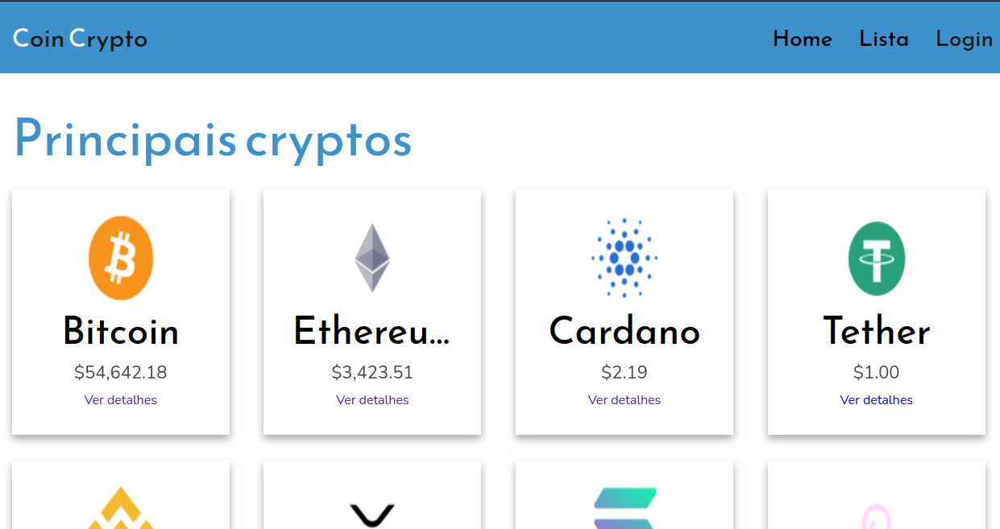
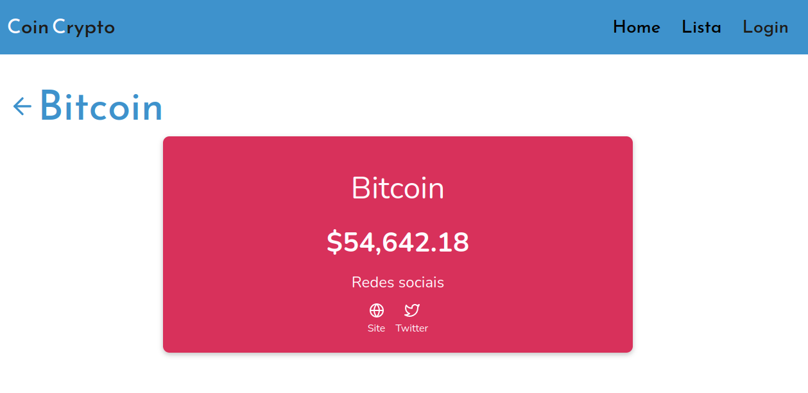

<div align="center" style="font-size: 48px; font-weight: bold;">
<span style="color: #3e92cc;">C</span>oin <span style="color: #3e92cc;">C</span>rypto
</div>

## About project

project made in Maratonas Academy course. This project show a cryptocurrency list with detail and current values.

## Built With :rocket:

- [ReactJS](https://reactjs.org/) - A JavaScript library for building user interfaces
- [Figma](figma.com/) - software to create wireframe
- [react-router-dom](https://reactrouter.com/web/guides/quick-start) - used to controll routes
- [axios](https://github.com/axios/axios) - Used to get api data
- [Intersection Observer API](https://developer.mozilla.org/en-US/docs/Web/API/Intersection_Observer_API) - A new Javascript api to control intersection observer element in page

## style guide :cyclone:

Color palette:

<div style="width:70px; height:60px; display:inline-block; margin-right:8px;">
<div style="background-color:#3e92cc; width:100%; height:100%;"></div>
  Light blue
</div>

<div style="width: 70px; height: 60px; display: inline-block; margin-right: 8px;">
<div style="background-color: #0a2463; width: 100%; height: 100%;"></div>
  Dark blue
</div>

<div style="width: 70px; height: 60px; display: inline-block; margin-right: 8px;">
<div style="background-color: #fffaff; width: 100%; height: 100%;"></div>
  White
</div>

<div style="width: 70px; height: 60px; display: inline-block; margin-right: 8px;">
<div style="background-color: #d8315b; width: 100%; height: 100%;"></div>
  Pink 
</div>

<div style="width: 70px; height: 60px; display: inline-block; margin-right: 8px;">
<div style="background-color: #1e1b18; width: 100%; height: 100%;"></div>
  Pink 
</div>

**margins:** 8px, 16px, 32px, 64px, 128px

**font-size**: 16px, 32px, 48px

### Landing page


### List Page



### Detail Page



## Getting Started :fire:

#### Prerequisites

This is an example of how to list things you need to use the software and how to install them.

- [yarn](https://classic.yarnpkg.com/lang/en/docs/install/#debian-stable)
  ```sh
  npm install --global yarn
  ```

#### Installation

1. Clone the repo

```sh
  git clone git@github.com:CleytonRR/coin-crypto.git
```

2. Install packages, in project folder:

```sh
  yarn install or yarn
```

## Run project :rocket:

In project folder:

```sh
  yarn start
```
